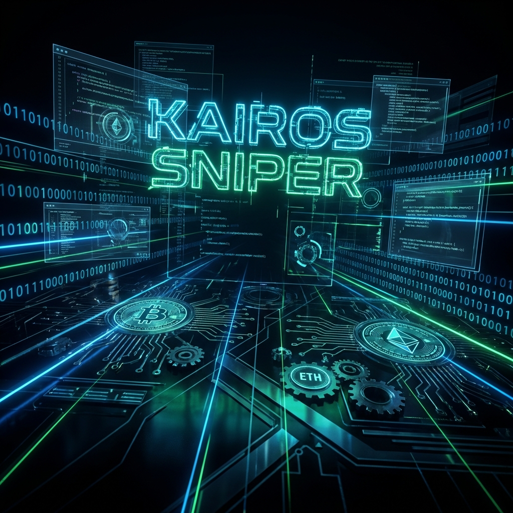
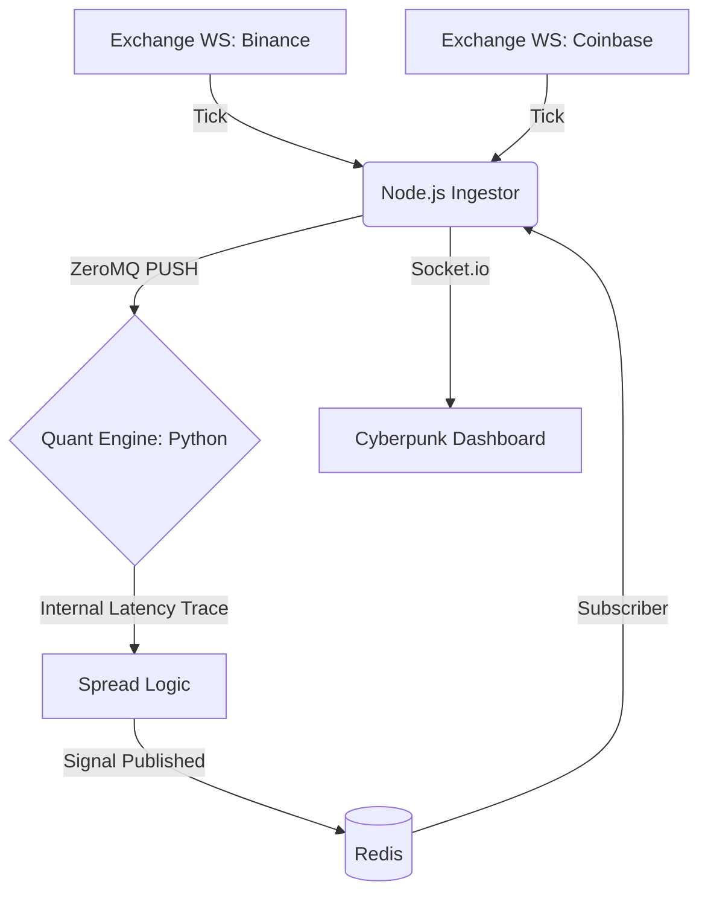

# ⚡ KAIROS // High-Frequency Arbitrage Sniper



> **System Status: OPTIMAL** 🟢  
> **Internal Latency: < 2.5ms** ⚡  
> **Architecture: Distributed Microservices (Event-Driven)** 🏛️

KAIROS is a state-of-the-art, high-frequency cryptocurrency arbitrage system designed for extreme performance and ultra-low latency. Built with a heterogeneous stack of **Node.js LTS**, **High-Performance Python**, and **Astro**, it intercepts market inefficiencies across multiple exchanges in real-time.

---

## 🛠 Tech Stack // The "Nervous System"

The project leverages the best-of-breed technologies to minimize the path from market tick to trade execution.

### 🔌 Ingestor (Node.js 22 LTS)

- **TypeScript (Strictly Typed)**: Ensures data integrity for financial tickers.
- **CCXT Pro**: Real-time WebSocket streams from top-tier exchanges.
- **ZeroMQ (PUSH Pattern)**: High-speed, brokerless messaging pipeline.
- **Async Queue Management**: Serialized PUSH operations to handle massive bursts of concurrent data.

### ⚙️ Quant Engine (Python 3.12)

- **`uv` Package Manager**: 100x faster dependency resolution and deterministic builds.
- **`uvloop`**: Drop-in replacement for the built-in asyncio event loop, bringing Python close to C++ performance.
- **ZeroMQ (PULL Pattern)**: Non-blocking data consumption.
- **Orjson**: Ultra-fast JSON parsing for sub-millisecond object instantiation.

### 📊 Tactical Dashboard (Astro 5 + React 19)

- **Tailwind CSS 4**: Next-gen CSS engine for a stunning "Cyberpunk HUD" aesthetic.
- **Socket.io**: Bi-directional event streaming for real-time visualization of arbitrage gaps.
- **Vite Optimization**: Optimized rendering pipeline for high UI update frequencies.

---

## 🏛 Architecture Overview



---

## ⚡ Performance Metrics

This system is engineered for **sub-5ms end-to-end latency**. By eliminating the message broker between capture and processing (using ZeroMQ), we've achieved internal processing times that outperform traditional cloud-based message queues (SQS, RabbitMQ) by a factor of 100x.

- **Ingestion to Processing (Direct Memory/TCP)**: ~0.1ms - 0.5ms
- **Spread Calculation & Logic**: ~0.05ms - 0.2ms
- **Overall System Internal Latency**: Consistently **< 2.5ms**

---

## 🚀 Getting Started (Docker-Ready)

The entire stack is containerized with **Production-Ready Multi-Stage Builds** and non-root users for maximum security.

1.  **Clone & Enter**:

    ```bash
    git clone https://github.com/your-username/kairos-sniper.git
    cd kairos-sniper
    ```

2.  **Launch the Fleet**:

    ```bash
    docker-compose up -d --build
    ```

3.  **Access the HUD**:
    Open `http://localhost:4321` to see the real-time interceptor in action.

---

## 🧠 Engineering Philosophy

- **Zero-Broker Latency**: We favor ZeroMQ over SQS/RabbitMQ to avoid network hops and broker overhead.
- **Modern Tooling**: Transitioned from legacy `pip` to `uv`, and `JS` to `TypeScript` for a professional, type-safe codebase.
- **Scalability**: Microservice-based design allows adding new exchange ingesters or engine instances without downtime.

---

## 🎨 Cyberpunk HUD Visuals

The dashboard isn't just "pretty"—it's a functional HUD designed for 24/7 monitoring, featuring:

- **Adaptive Latency Indicators**: Color-coded badges (Cyan < 2ms, Amber > 3ms).
- **Holographic Transaction Cards**: Real-time signal feed with scanline effects.
- **Neon Grid System**: Built on Tailwind CSS 4 for lightweight, high-performance styling.

---

### Developed by [Your Name/GitHub Name]

_Passionate about High-Frequency Systems, distributed architectures, and modern engineering._
